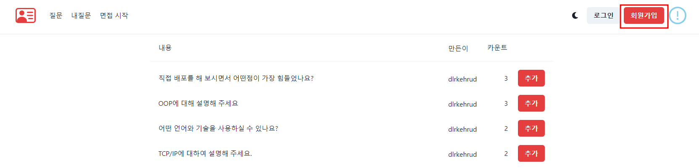
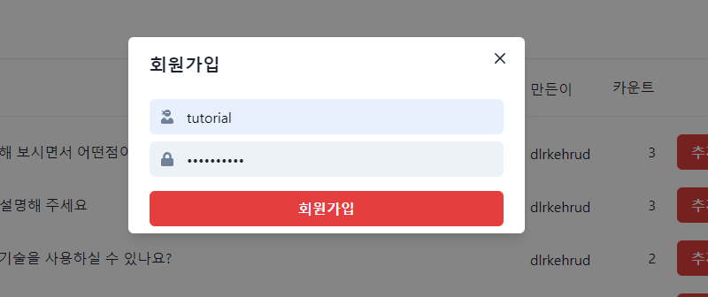
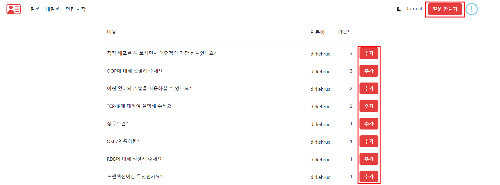
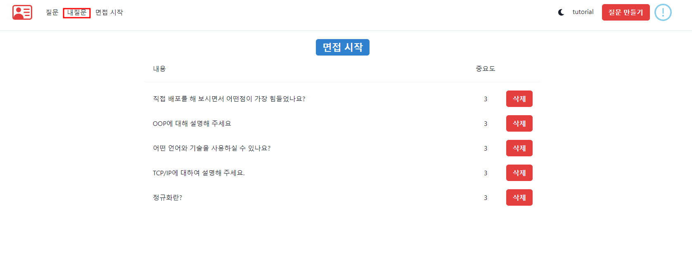
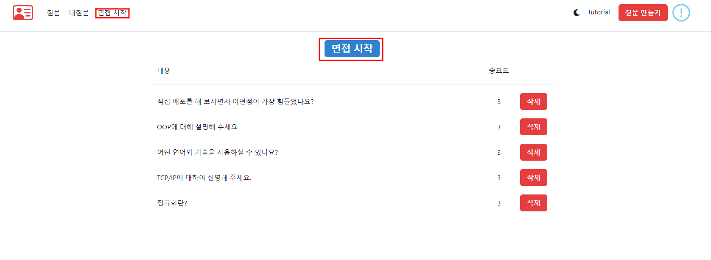
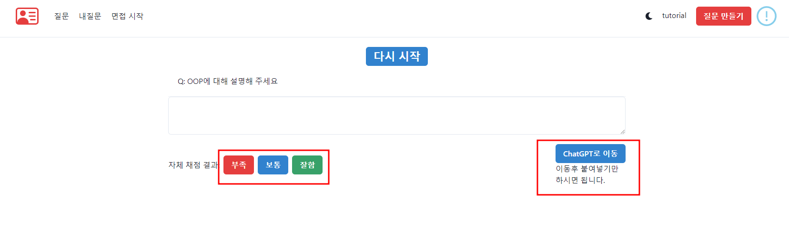
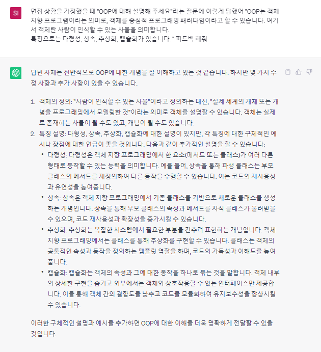

## 회원가입

1. 회원가입을 해 주세요. 

아이디와 비밀번호만 설정해 주시면 됩니다.

---

## 질문추가 하기 

질문을 추가해 주세요. 마음에 드는 질문이 없으면 오른쪽 위에 버튼을 통해 질문을 만들어 주세요.

***

## 내 질문 관리하기 

내 질문을 가시면 현재 선택한 질문을 볼 수 있습니다. 

### 면접시작하기 

이제 면접 시작을 누르면 랜덤으로 질문이 나오게 됩니다. 

---

## 면접 시작 페이지 및 설명 

설명을 적은 후 오른쪽 아래의 버튼을 클릭하면 ChatGPT로 이동하며 질문과 본인이 쓴 글이 자동 저장이 됩니다. 

ex) Q: OOP에 대해 설명해 주세요. 

"OOP는 객체 지향 프로그램이라는 의미로, 객체를 중심적 프로그래밍 패러다임이라고 할 수 있습니다. 여기서 객체란 사람이 인식할 수 있는 사물을 의미합니다. 
특징으로는 다형성, 상속, 추상화, 캡슐화가 있습니다. "

(클릭)=> 

면접 상황을 가정했을 때 "OOP에 대해 설명해 주세요"라는 질문에 이렇게 답했어 "OOP는 객체 지향 프로그램이라는 의미로, 객체를 중심적 프로그래밍 패러다임이라고 할 수 있습니다. 여기서 객체란 사람이 인식할 수 있는 사물을 의미합니다. 
특징으로는 다형성, 상속, 추상화, 캡슐화가 있습니다. " 피드백 해줘

이 ChatGPT의 답변을 바탕으로 "부족", "보통", "잘함"을 채점 하시면 됩니다. 

부족을 클릭하면 중요도가 올라가고, 보통은 그대로, 잘함은 중요도가 낮아 집니다. 

중요도가 올라가면 해당 질문이 나올 확률이 증가하게 됩니다. 

예를들어 질문 A 중요도가 5, B가 3, C가 2라고 한다면 

A가 나올 확률 50%, B가 나올 확률 30%, C가 나올 확률 20%가 됩니다. 

이 시스템을 통해 어려워하는 질문은 자연스럽게 나오는 빈도수가 증가하고, 알고 있는 질문이 나오는 빈도수는 줄어들게 됩니다. 